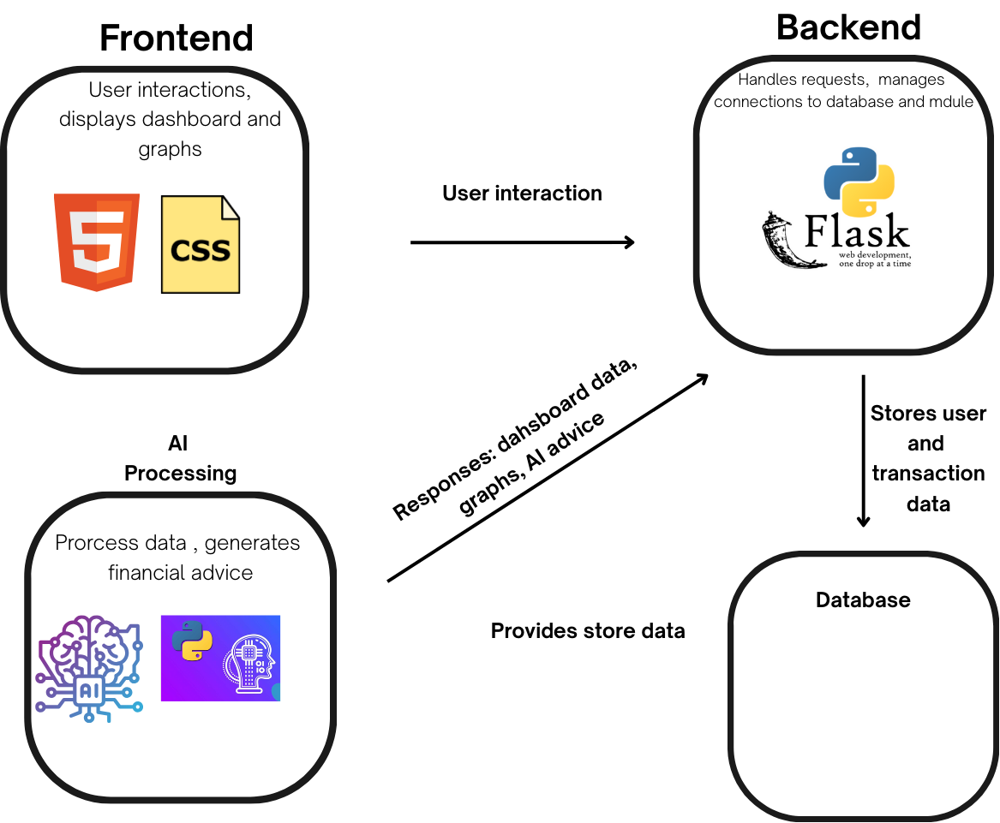

  
  

    <a href='https://github.com/drod75/cisc3140-project'><h1>CISC3140 Web Project</h1></a>
  

  

## What is it?

Our project for Computer Science 3140 Design and Implementation of Large Scale Applications aims to create a finance tracker that aims to help users keep track of their finances and present them with advanced graphs for their every day use and analysis. Along with this we want users to get AI generated financial advice 
backed by legitimate financial data so users can make better financial decisions. We aim to give users a 
tool that is simple and easy to use and can help them make better financial decisions, and improve their lives by allowing them to budget better, thank you and enjoy our project!

  

## Who are we?

Our team consists of:

- David Rodriguez
- Lin Zheng
- Kedar Chinnery
- Celso Gonzalez
- Andy Chen

  

## What will we use?

  

## How does it work?

Our app first prompts users to login or register, after you register for the first time your userdata is stored in supabase via the cloud, once this happens you can log in and start using our app! Once you
log in you will be presented with your dashboard, there will be nothing at first so you can head to the 
transaction logging page and log your transactions! Your transaction data will be kept in supabase also and you can go back to your dashboard to view them and view graphs. Along with this there is our AI Page where
our AI system will present you with recommendations based on your transactions which will be backed by legitimate financial data. Below is a graph that shows you how it works: 

  

## Credits

Thank you to the libraries we used for this project:
- Web Routing and Creation

  - Flask https://flask.palletsprojects.com/en/stable/, Flask is the web framework in python and has been around since 2010, it is useful for creating web applications in python and is great for ensuring a good python to web flow.

  - Flask-WTF https://flask-wtf.readthedocs.io/en/1.2.x/, is based on WTForms and is used to make the two more compatible and easy to use, this allows for easy code to handle forms and makes using forms for data very easy in flask. We used it to create multiple forms for login, registering, transaction insertion, and each used easy to understand code with minimal effort to achieve.

  - WTForms https://wtforms.readthedocs.io/en/3.2.x/, is a form creation, validation, and visualization library for python. This allows forms to be made in python with specific field types and allows them to work very well in web applications.

- Database

  - Supabase https://supabase.com/docs/reference/python/introduction, is a cloud open source version of Google's Firebase, it allows for cloud database use of a postgresql  flavored sql database. It allows for multiple languages to use it and was key for our project, it allowed for database insertion and fetching in python without having to deal with a database locally.

- Graphing

  - Plotly https://plotly.com/python-api-reference/, is a popular Graphing API made for web use in python, it has amazing features such as zooming in and filtering built into graphs and is not hard to learn. Plotly has the ability to turn graphs made in python to html so it was useful to use as it made using on language possible and simple.

- LLM

  - Langchain https://python.langchain.com/docs/integrations/chat/google_generative_ai/, is a popular python library that allows for use of AI and with tons of features baked in, it allows for custom prompts, custom outputting, and can use almost any model out there. We used Gemini since it is one the most powerful family of models and is free, it was useful and is something that always never disappoints.

  - https://python.langchain.com/docs/concepts/prompt_templates/, this is the direct link to using custom prompts with Langchain and is pretty easy to use, since Langchain allows for any model it can use to use its features it allows for easy model switching without compromising the prompt. We used this to pass the Transaction Data so it can make ten recommendations, this is where prompt engineering came into handy and it helped us make great use of Gemini

  - https://python.langchain.com/docs/how_to/output_parser_json/, this is about outputting as a json using Langchain, it was useful to figure out how to get the model to output as you want and with the prompt template allowed for us to force the model to really output as we want via Prompt Engineering and Output Parsing. It allows for our model to parse its output as json for ease of use. We passed this to our html files and using them allowed us to display our recommendations without having to use more than one language.

